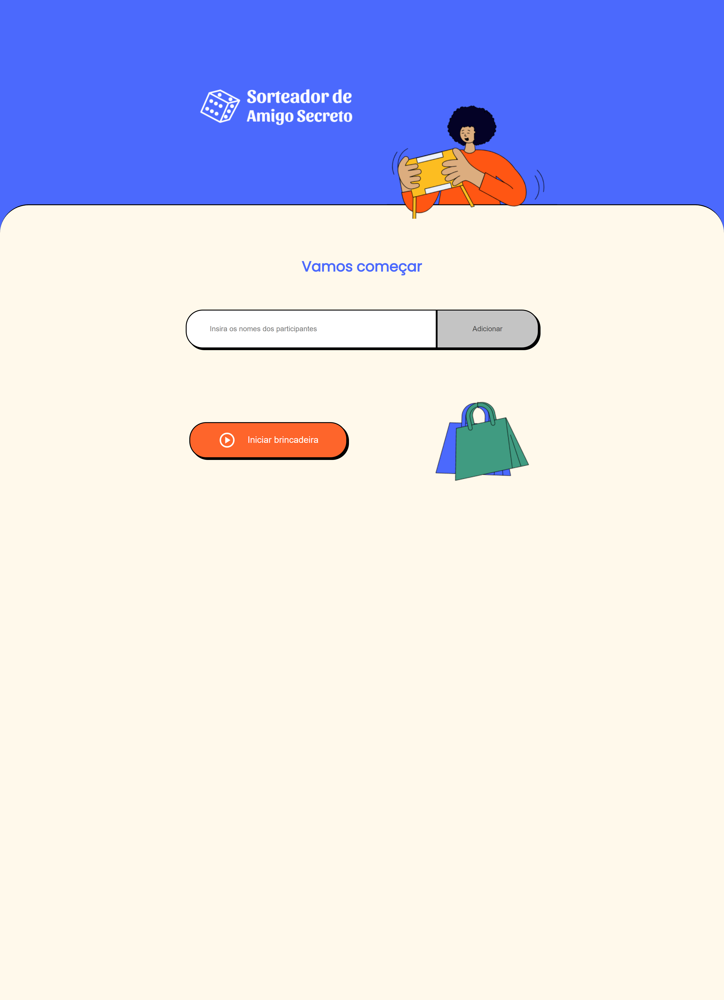
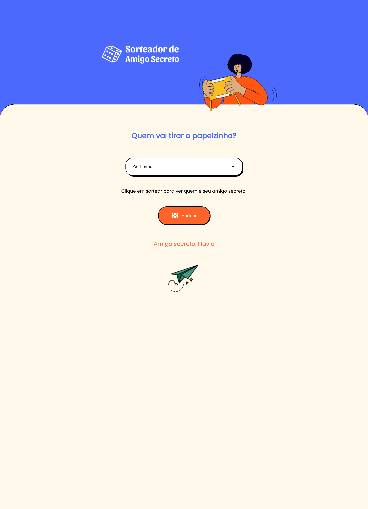

<h1 align="center">
    Sorteador de amigo secreto
</h1>

<p align="center">
  

  
  
  <a href="https://github.com/Veronezegui/sorteador-de-amigo-secreto/commits/main">
    
  </a>
    
   
  
  
</p>

<h4 align="center">
	🚧   Concluído 🚀 🚧
</h4>

## 💻 Sobre o projeto

Sorteador de amigo secreto - é uma aplicação desenvolvida em React.js com Typescript. Trata-se de uma página que permite o usuário cadastrar todos os participantes de uma brincadeira de amigo secreto e então realizar o sorteio entre eles. O interessante desse projeto é que ele foi desenvolvido utilizando o TDD (Test Driven Development), ou seja, desenvolvimento orientado por testes, todos os componentens e funcionalidades foram codificados apartir da criação de testes unitários.

---

## 🎨 Layout

<p align="center">

  

</p>

<p align="center">

  

</p>

---

## 🚀 Como executar o projeto

## Pré-requisitos

Antes de começar, você vai precisar ter instalado em sua máquina as seguintes ferramentas:
[Git](https://git-scm.com), [Node](https://nodejs.org/). 
Além disto é bom ter um editor para trabalhar com o código como o [VSCode](https://code.visualstudio.com/).

#### 🎲 Clonando o repositório e instalando as dependências

```bash

# Clone este repositório
$ git clone https://github.com/Veronezegui/sorteador-de-amigo-secreto.git

# Instale as dependências web
$ npm install

# Execute a aplicação em modo de desenvolvimento
$ npm start

# O servidor inciará na porta:3000 - acesse http://localhost:3000

```

## 🦸 Autor


 <br />
 <sub><b>Guilherme Veroneze</b></sub></a> 🚀
 <br />


---

## 📝 Licença

Este projeto está sob a licença [MIT](./LICENSE).

Feito com muita dedicação por Guilherme Veroneze 👋🏽 [Entre em contato!](https://github.com/Veronezegui)

---
